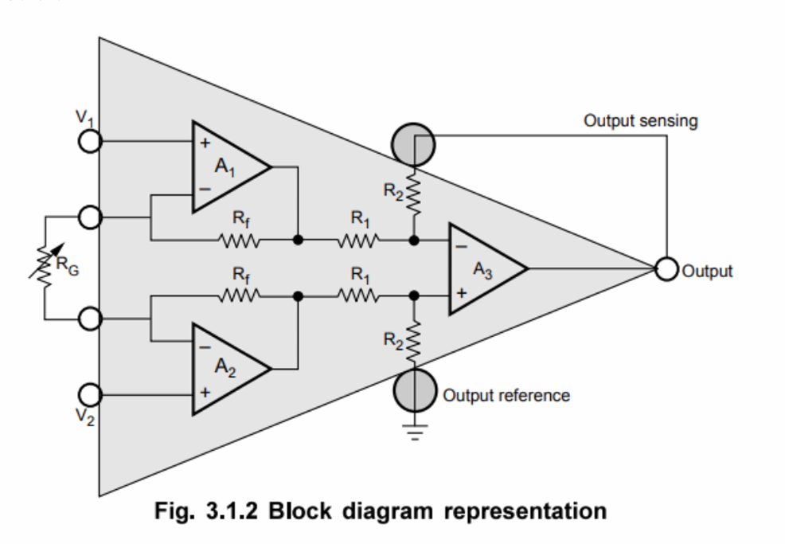
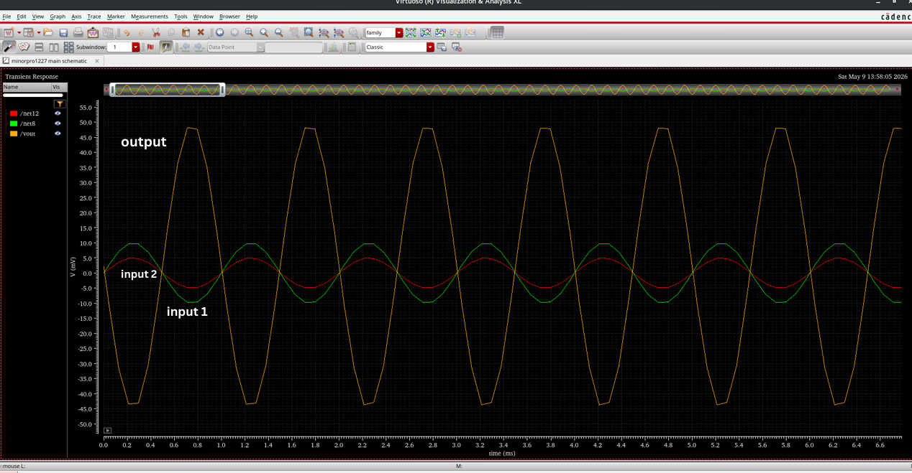
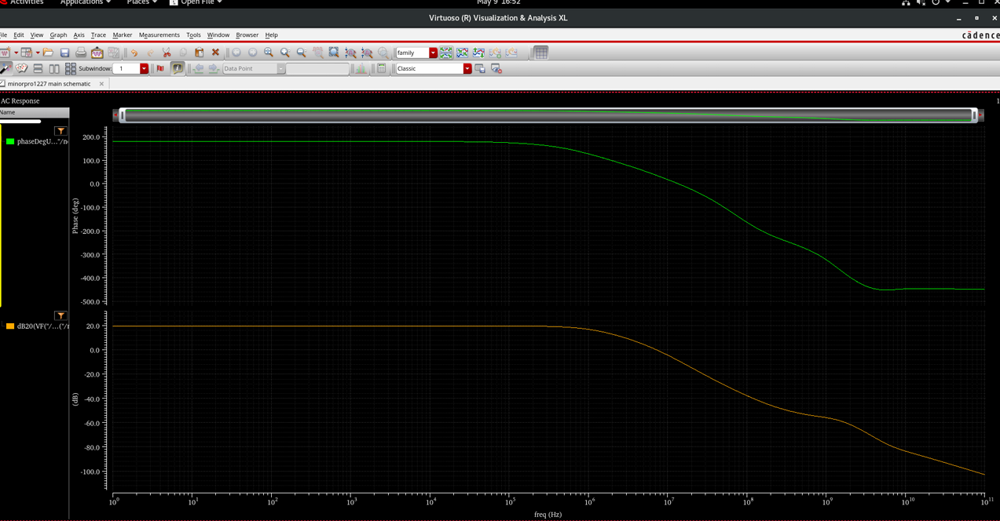

# Instrumentation Amplifier — 3-Op-Amp Design with PVT Corner Analysis

A 3-op-amp instrumentation amplifier designed in Cadence Virtuoso (180nm CMOS), 
using two-stage CMOS op-amp cores, validated across process, voltage, and 
temperature corners for product-binning-grade robustness.

## Architecture

The instrumentation amplifier uses the classic 3-op-amp topology:
- **Stage 1 — Input Buffers (U1, U2):** Non-inverting configuration, high input 
  impedance, amplifies the differential signal while passing common-mode signals 
  through unchanged.
- **Stage 2 — Difference Amplifier (U3):** Subtracts the two buffered outputs, 
  eliminating common-mode signal and delivering the final amplified differential output.

**Gain equation:**
​```
A_D = (R2/R1) · (1 + 2Rf/RG)
​```


## Transistor Sizing (180nm, VDD = 1.8V, Bias = 20µA)

| Transistors | Block   | Aspect Ratio (W/L) |
|-------------|---------|---------------------|
| M0, M8      | Op-amp  | 6µ / 1µ             |
| M1, M3      | Op-amp  | 14µ / 1µ            |
| M4, M7      | Op-amp  | 12µ / 1µ            |
| M2          | Op-amp  | 32µ / 200n          |
| M5          | Op-amp  | 37.5µ / 500n        |

## Schematics

- [OPAMP Schematic](Schematics/opamp_schematic.png)
- [OPAMP Symbol](Schematics/opamp_symbol.png)
- [Full Instrumentation Amplifier Schematic](Schematics/IA_schematic.png)
- [LTspice Simulation Schematic](Schematics/ltSpice_schematic.png)

## Simulation Results

**Transient Analysis** — differential inputs and amplified output:



**AC Analysis — Gain & Phase:**



- Differential gain: ~20 dB at 1.8V
- Bandwidth: ~1.9 MHz (TT corner)

## PVT (Process, Voltage, Temperature) Analysis Summary

| Parameter        | FF    | TT    | FS    | 1.78V | 1.80V | 1.82V | 0°C   | 27°C  | 80°C  |
|------------------|-------|-------|-------|-------|-------|-------|-------|-------|-------|
| Gain (dB)        | 19.71 | 19.81 | 19.81 | 19.65 | 19.81 | 19.71 | 19.65 | 19.81 | 19.79 |
| Bandwidth (MHz)  | 1.780 | 1.909 | 1.874 | 1.463 | 1.909 | 1.543 | 1.463 | 1.909 | 1.863 |

*Process corners tested across FF/SS/TT/FS/SF; supply and temperature variation 
shown at TT corner.*

## Applications

Instrumentation amplifiers are used in data acquisition from low-output 
transducers (thermocouples, strain gauges, Wheatstone bridge measurements), 
biomedical/ECG signal conditioning, and other applications requiring high 
CMRR and precision gain in noisy environments.

## Tools Used

Cadence Virtuoso, LTspice, 180nm CMOS Technology

## Team

Group project (MNIT Jaipur, VI Sem Minor Project, 22ECW351) — 5 members. 
Contributed across all stages: architecture, transistor sizing, schematic 
design, PVT corner simulation, and results analysis.

## References

1. B. P. Sharma and R. Mehra, "Design of CMOS Instrumentation Amplifier with 
   Improved Gain & CMRR for Low Power Sensor Applications," Department of ECE, 
   B.K. Birla Institute of Engineering and Technology, Pilani / NITTTR Chandigarh.
2. R. Bharath Reddy and Shilpa K. Gowda, "Design and Analysis of CMOS Two Stage 
   OP-AMP in 180nm and 45nm Technology," International Journal of Engineering 
   Research & Technology (IJERT), SJB Institute of Technology, Bengaluru.
3. Shruti Suman, "Two Stage CMOS Operational Amplifier: Analysis and Design," 
   Department of Electronics and Communication Engineering, Koneru Lakshmaiah 
   Education Foundation (KL University), Guntur, Andhra Pradesh.
4. Texas Instruments, "What Is an Instrumentation Amplifier?" Texas Instruments 
   Technical Article.
